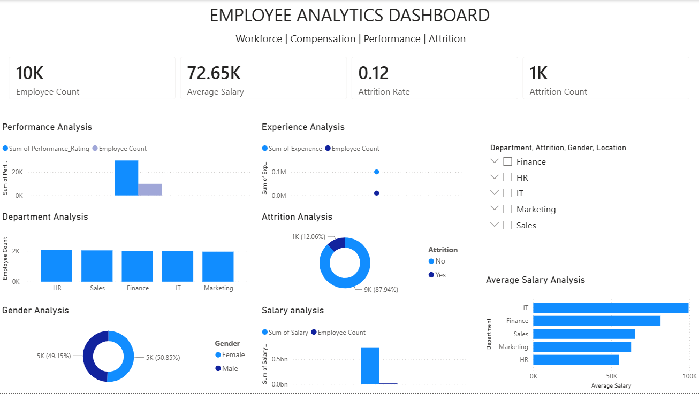

# Employee Data Analysis Dashboard

## 📊 Project Overview

This project analyzes employee data to identify insights related to workforce distribution, compensation, performance, and employee attrition.

The project follows a complete data analytics workflow using **Python, SQL, Excel, and Power BI**, starting from data cleaning and exploration through to interactive dashboard development.

## 🎯 Business Objectives

* Analyze employee distribution across departments and locations
* Understand salary patterns and compensation differences
* Analyze employee demographics such as age and gender
* Examine employee experience levels
* Analyze performance ratings
* Measure employee attrition
* Build an interactive dashboard to support HR decision-making

## 🛠️ Tools & Technologies

* **Python** — Pandas, data cleaning and preprocessing
* **SQL** — MySQL, data querying and analysis
* **Excel** — Data exploration, sorting, filtering and Pivot Tables
* **Power BI** — Interactive dashboard and data visualization
* **GitHub** — Project documentation and portfolio

## 📁 Project Structure

```text
Employee-Data-Analysis/
│
├── Dataset/
│   └── employee_data_cleaned.csv
│
├── Python/
│   └── employee_analysis.ipynb
│
├── SQL/
│   └── queries.sql
│
├── PowerBI/
│   └── Employee_Analytics_Dashboard.pbix
│
├── Screenshots/
│   └── dashboard.png
│
└── README.md
```

## 🔄 Project Workflow

### 1. Data Preparation

A dataset containing approximately 10,000 employee records was prepared for analysis.

The data includes information such as:

* Employee ID
* Gender
* Age
* Department
* Designation
* Education
* Experience
* Salary
* Joining Date
* Location
* Performance Rating
* Overtime
* Attrition

### 2. Excel Analysis

The dataset was initially explored using Excel.

Activities included:

* Sorting and filtering
* Identifying duplicate records
* Exploring data distributions
* Creating Pivot Tables
* Basic employee and department analysis

### 3. Python Data Cleaning

Python and Pandas were used to prepare the data for analysis.

Key steps included:

* Reading the CSV dataset
* Inspecting the dataset
* Handling missing values
* Removing duplicate records
* Detecting potential outliers
* Creating derived columns
* Exporting the cleaned dataset

### 4. SQL Analysis

MySQL was used to store and analyze the cleaned employee dataset.

The analysis includes queries using:

* SELECT
* WHERE
* ORDER BY
* GROUP BY
* Aggregate functions
* HAVING
* Business-focused employee analysis

Additional advanced SQL analysis can be extended using joins, subqueries, CTEs, and window functions.

### 5. Power BI Dashboard

An interactive Power BI dashboard was created to provide a visual overview of the workforce.

### Dashboard Includes

* 👥 Total Employee Count
* 💰 Average Salary
* 📉 Attrition Rate
* ❌ Attrition Count
* 🏢 Employees by Department
* 👨‍👩‍👧 Gender Distribution
* 📊 Salary Distribution
* 📈 Experience Analysis
* ⭐ Performance Rating Analysis
* 🔎 Interactive slicers and filters

## 📸 Dashboard Preview



## 💡 Key Business Insights

The dashboard can be used by HR and management teams to:

* Compare workforce size across departments
* Identify salary differences between departments
* Monitor employee attrition
* Understand workforce demographics
* Analyze experience and performance patterns
* Filter employee information by department, gender, location, and attrition status

## 📌 Skills Demonstrated

**Data Analytics:**
Data Cleaning • Data Exploration • Data Validation • Business Analysis

**Technical Skills:**
Python • Pandas • SQL • MySQL • Excel • Power BI • DAX

**Visualization:**
Dashboard Design • KPI Development • Interactive Filters • Data Visualization

## 🚀 Future Improvements

* Add advanced SQL analysis using CTEs and window functions
* Add time-based attrition analysis
* Add deeper salary and performance analysis
* Add additional HR KPIs
* Improve dashboard interactivity and drill-through functionality

## 👤 Author

**Suhail Shaik**

MCA — Artificial Intelligence

Aspiring Data Analyst
